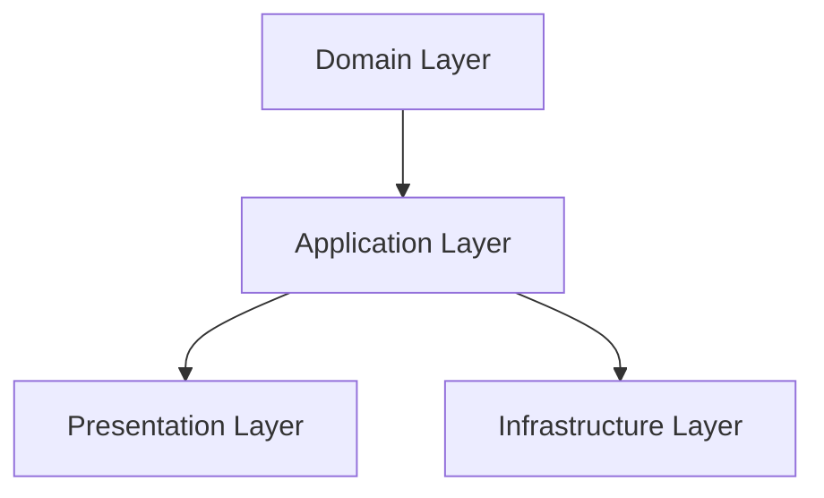

# Modules

Just a bit of clean architecture inspired by [Uncle Bob's Clean Architecture](https://www.oreilly.com/library/view/clean-architecture-a/9780134494166/) and [The Clean Architecture in React](https://leanpub.com/the-clean-architecture-in-react/read) book.
The goal is to separate the concerns of your application into different layers, making it easier to maintain and test.

## Layers



## Sample folder structure

```
feature/                      # Reusable feature module (e.g., posts, profile, auth)
├── domain/                   # Core business rules
│   ├── entities/             # Core domain models
│   │   └── Item.ts           # E.g., Post, User, Product
│   ├── repositories/         # Interfaces used by the use cases
│   │   └── ItemRepository.ts
│   ├── value-objects/        # Simple, static reusable data objects
│   │   └── ItemType.ts       # E.g., Gender, Currency
│
├── infrastructure/           # Implementation details for APIs, DB, etc.
│   ├── api/                  # REST/GraphQL clients or helpers
│   │   └── itemApi.ts        # e.g., fetchItemById, createItem, etc.
│   ├── repositories/         # Concrete implementation of domain interfaces
│   │   └── ItemRepository.ts
│   └── swr/                  # SWR data fetching hooks
│       └── useItem.ts        # Hook to fetch a single item
|
│   # Application layer: we don't use dtos hence unpacked application layer.
├── usecases/                 # Business logic operations, coordinating domain & infra
│   ├── fetchItem.ts          # Orchestrates fetching a domain item
│   └── createItem.ts         # Handles submission + validation
│
└── presentation/             # UI for this feature (Next.js pages, forms, components)
    ├── pages/                  # App Router integration
    │   ├── item-page.tsx
    │   └── create-page.tsx
    ├── view-models/           # View models for the UI (state, data mapping, events)
    │   ├── ItemViewModel.ts
    │   └── CreateItemViewModel.ts
    ├── components/           # Feature-specific UI components
    │   ├── ItemForm.tsx
    │   └── ItemCard.tsx
    └── hooks/                # UI logic (forms, view models)
        ├── useItemForm.ts    # react-hook-form for creation/edit
        └── useItemView.ts    # Optional view logic, derived state
```
